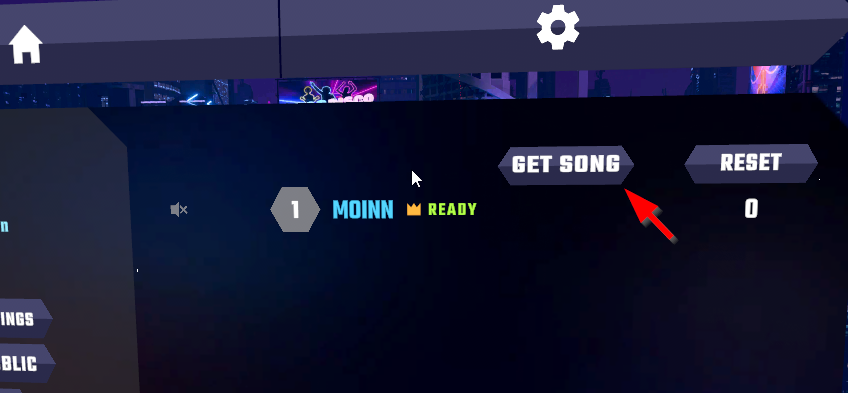

# MultiplayerSongGrabber

Download missing custom songs with the click of a button inside a multiplayer lobby!
For Synth Riders [PCVR]

## Setup
!After an update you might have to either grab the newest release of MultiplayerSongGrabber or reinstall MelonLoader completely!

0. Backup your game files (most important files are songs and settings)
1. Prepare Synth Riders for the use with mods by following the installation instructions for MelonLoader:  https://wiki.synthriderz.com/en/guides/installing-mods
2. Grab the newest version of MultiplayerSongGrabber from releases and add it under ./SynthRiders/Mods (create new directory if not existent)
5. Profit?!

## Disclaimer
This mod is not related to Synth Riders Devs or Kluge Interactive.

## TODO
* Add option for auto download
* Add tooltip to button
